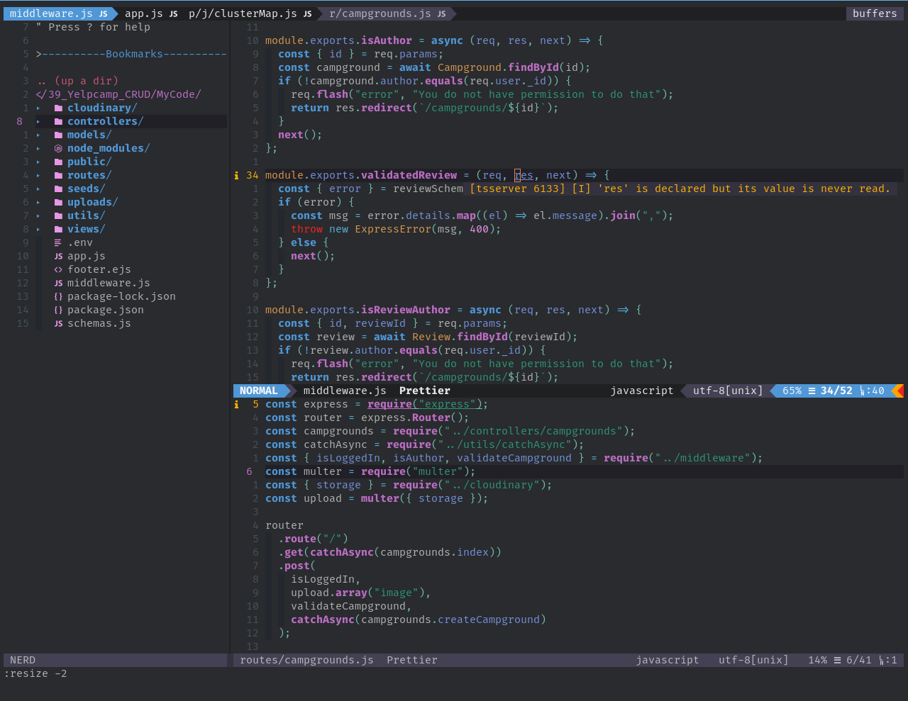
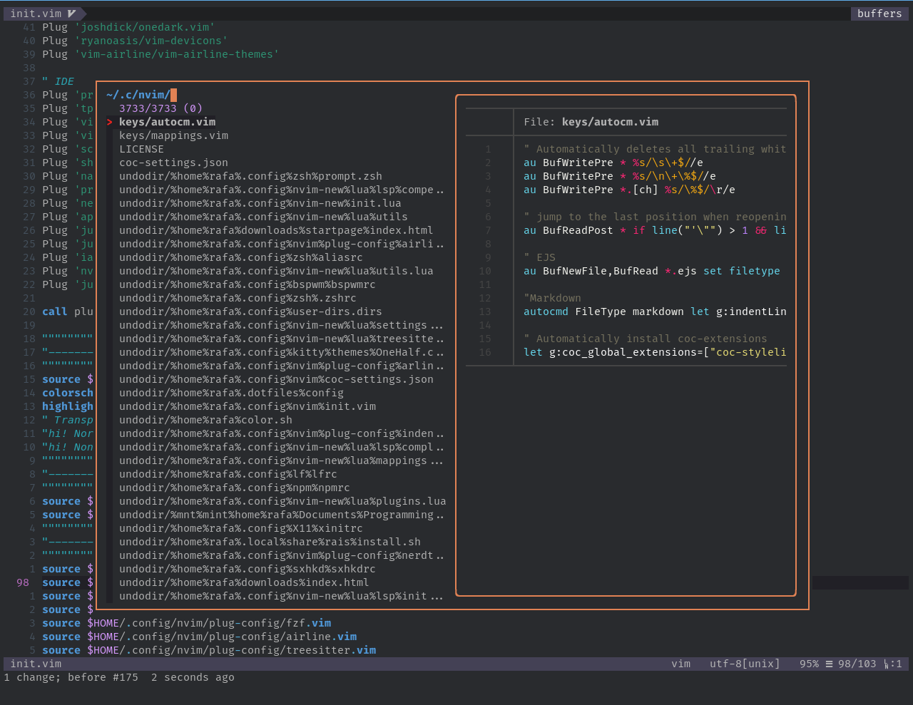
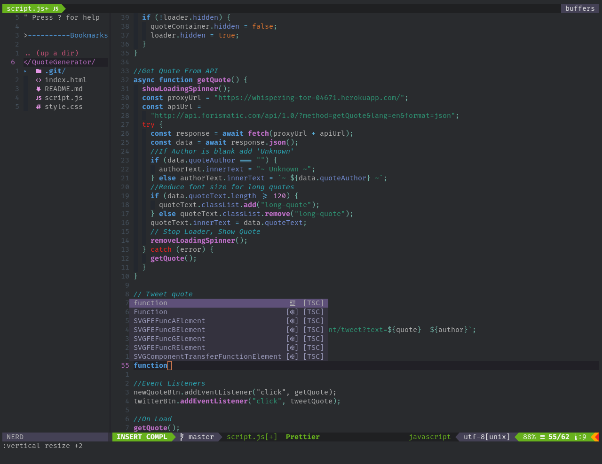

Neovim old configs based on vimscript, my main configuration has been moved over to lua. You can find it [here](https://github.com/rafamadriz/dotfiles/tree/main/.config/nvim)

## Requirements

- [Neovim 0.5.0](https://github.com/neovim/neovim/releases/tag/nightly)
- [fzf](https://github.com/junegunn/fzf)
- [ripgrep](https://github.com/BurntSushi/ripgrep)
- [bat](https://github.com/sharkdp/bat)
- [vim plug](https://github.com/junegunn/vim-plug)
- [xsel](http://www.kfish.org/software/xsel/) (clipboard support)
- [nodejs](https://nodejs.org/en/download/) (LSP support)

## Features

- Diagnostics

- Fuzzy finder

- Completion with LSP

- And more...

## LICENSE

[GPLv3](https://github.com/rafamadriz/nvim-old/blob/master/LICENSE)
